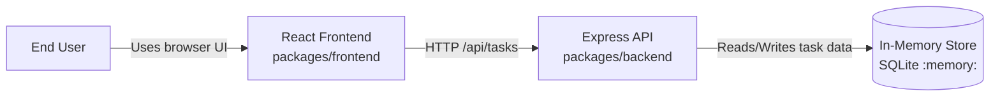
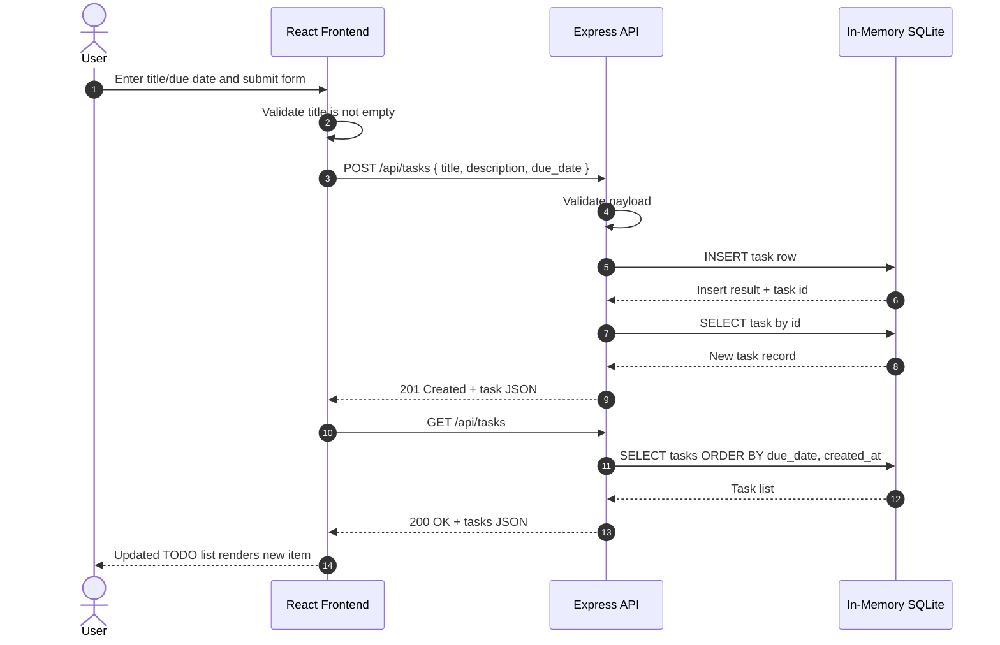

# Cloud Architecture Overview

This document provides a simple system context view of the Todo monorepo runtime architecture.

## System Context Diagram

## Sequence Diagram: Create TODO

## Notes

- The frontend and backend are developed in a single monorepo.
- The API persists task data in an in-memory SQLite database.
- Data is ephemeral and resets when the backend process restarts.
